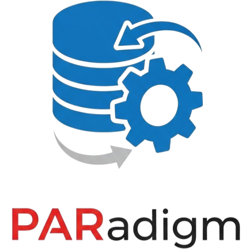

Of course. A great project deserves a great README. This is the front door for any developer who discovers your work.

Based on everything we've built and discussed, here is a comprehensive, professional README.md file for PARadigm. It covers the project's purpose, its key features (especially the AI), and how others can run it locally.

Just copy and paste this into a README.md file in the root of your project.

Generated markdown
# PARadigm: AI-Validated Parfile Constructor



An intelligent, web-based utility for generating and validating Oracle Data Pump parameter files. PARadigm acts as an AI-powered co-pilot for Oracle DBAs and developers, helping to create accurate, efficient, and safe `expdp` and `impdp` configurations.

**[➡️ Live Demo: paradigm-1c1.pages.dev](https://paradigm-1c1.pages.dev/)**

---

## Table of Contents

- [About The Project](#about-the-project)
- [Key Features](#key-features)
- [Live Demo & Screenshots](#live-demo--screenshots)
- [Tech Stack](#tech-stack)
- [Getting Started](#getting-started)
  - [Prerequisites](#prerequisites)
  - [Installation](#installation)
- [The AI Validation Engine](#the-ai-validation-engine)
- [Contributing](#contributing)
- [License](#license)

## About The Project

Manually creating Oracle Data Pump parfiles can be a tedious and error-prone process. A single misplaced parameter, a subtle syntax error, or a logical conflict between options can lead to failed jobs, wasted time, and potential production issues.

PARadigm was built to solve this problem by providing a clean, intuitive interface and a powerful, two-tiered validation system. It guides the user in creating syntactically correct parfiles while leveraging a sophisticated AI engine to uncover deeper logical issues, performance traps, and potential security risks that a human might miss.

This tool transforms parfile creation from a manual chore into a quick, confident, and intelligent workflow.

## Key Features

- **Intuitive UI:** A clean, responsive interface with both Light and Dark modes.
- **Full Parameter Support:** Configure a comprehensive range of `expdp` and `impdp` parameters, from basic setup to advanced options.
- **Instant Local Validation:** The UI provides real-time feedback, catching syntax errors and required field violations as you type.
- **🧠 Advanced AI Validation:** The star feature. At the click of a button, your configuration is sent to a Google Gemini-powered engine that provides "Senior DBA-level" insights, including:
  - **Logical Conflict Detection:** Catches subtle errors like the `REMAP_SCHEMA`/`REMAP_TABLE` order of operations.
  - **Performance Trap Warnings:** Identifies combinations (like `QUERY` + `DIRECT_PATH`) that can silently degrade performance.
  - **Security & Compliance Audits:** Warns about exporting potentially sensitive data (e.g., from an HR schema).
  - **Environmental & Prerequisite Checks:** Suggests verifying roles, permissions, and disk space.
- **Seamless Workflow:** The "Create Matching Import" button instantly converts a validated export configuration into a logical import setup.
- **Copy-to-Clipboard:** Easily copy the generated parfile content or the full `nohup` command line for execution.

## Live Demo & Screenshots

**Try PARadigm now:** **[https://paradigm-1c1.pages.dev/](https://paradigm-1c1.pages.dev/)**

*TODO: ADD IMAGES OR VIDEOS*

## Tech Stack

- **Frontend:** [React](https://reactjs.org/), [TypeScript](https://www.typescriptlang.org/), [Vite](https://vitejs.dev/), [Tailwind CSS](https://tailwindcss.com/)
- **Backend (Serverless):** [Cloudflare Pages Functions](https://developers.cloudflare.com/pages/functions/)
- **AI Engine:** [Google Gemini](https://ai.google.dev/)

## Getting Started

To get a local copy up and running, follow these simple steps.

### Prerequisites

- Node.js (v18 or later)
- npm

### Installation

1.  **Clone the repo:**
    ```sh
    git clone https://github.com/your-username/rajatchauhannn-parfile-forge.git
    cd rajatchauhannn-parfile-forge
    ```

2.  **Install NPM packages:**
    ```sh
    npm install
    ```

3.  **Set up environment variables:**
    The AI validation feature requires a Google Gemini API key.
    - Create a file named `.env` in the root of the project.
    - Add your API key to this file:
      ```
      GEMINI_API_KEY='YOUR_API_KEY_HERE'
      ```
    - You can get a free API key at [Google AI Studio](https://makersuite.google.com/).

4.  **Run the development server:**
    This project uses Cloudflare's `wrangler` to serve the application and the serverless function locally.
    ```sh
    npm run dev
    ```
    This will start the Vite frontend and the Wrangler backend concurrently. Open your browser to the local address provided (usually `http://localhost:5173`).

## The AI Validation Engine

PARadigm uses a two-tier validation approach:

1.  **Client-Side Validation:** The React application is packed with real-time checks that validate the syntax, format, and required nature of parameters as you interact with the form. This provides instant feedback for common mistakes.

2.  **Server-Side AI Validation:** When you click "Validate with AI," the application sends the current parfile configuration to a secure, serverless Cloudflare Function. This function, in turn, queries the Google Gemini API with a specialized prompt containing the user's configuration and a set of expert-level rules. The AI's response is parsed and displayed, providing insights that go far beyond simple syntax checking.

## Contributing

Contributions are what make the open-source community such an amazing place to learn, inspire, and create. Any contributions you make are **greatly appreciated**.

If you have a suggestion that would make this better, please fork the repo and create a pull request. You can also simply open an issue with the tag "enhancement".

1.  Fork the Project
2.  Create your Feature Branch (`git checkout -b feature/AmazingFeature`)
3.  Commit your Changes (`git commit -m 'Add some AmazingFeature'`)
4.  Push to the Branch (`git push origin feature/AmazingFeature`)
5.  Open a Pull Request

## License

Distributed under the MIT License. See `LICENSE.txt` for more information.
